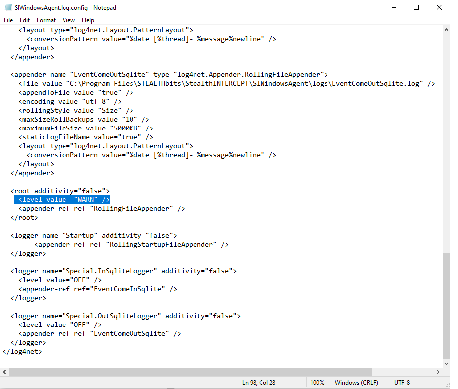

# Enabling debug logging on the Netwrix Threat Manager Windows agent

## Summary
Enabling debug logging on the Netwrix Threat Manager Windows agent.

## Issue
How to enable debug logging on the Netwrix Threat Manager Windows agent.

## Instructions
There are two options.

### Option 1
1. Access the server with the SI Windows agent running.
2. Open the Windows Agent installation folder. The default location is `...\STEALTHbits\StealthINTERCEPT\SIWindowsAgent\`
3. Edit the file named `SIWindowsAgent.log.config` in your favorite text editor.
4. Change `WARN` to `DEBUG` in the appropriate portion of that file:

   

5. Save the `.log.config` file and restart the `SIWindowsAgent` service.

### Option 2
1. Open the Netwrix Threat Prevention Administration Console on the SI management server.
2. Select **Agents**.
3. Click on the Pencil icon at the top left of the window.
4. Change the drop-down under **New Agent Log Level** to `DEBUG`.
5. Highlight the desired agents you wish to change the log level of from the list below.
6. Click the **Update Log Levels** button.

After collecting debug logs, set Netwrix Threat Prevention Windows agent logging back to `WARN`.

## Module
SI - Windows Agent

## Salesforce Article ID
000001064
