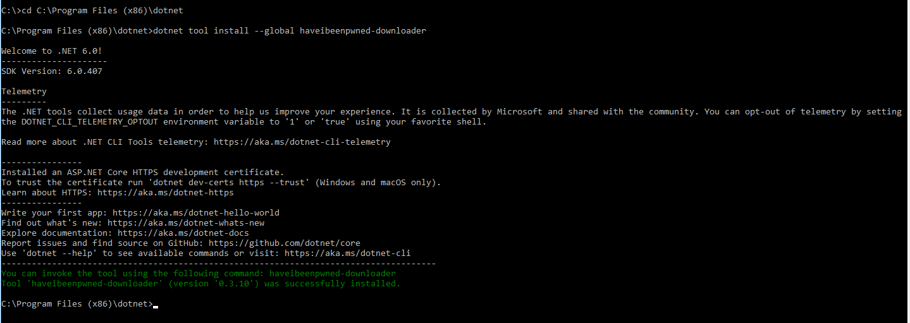

# Updating the Have I Been Pwnd NTML Hash List

## Overview
The Pwnd Passwords Downloader is a dotnet tool to download all Pwned Passwords hash ranges and save them offline so they can be used without a dependency on the k-anonymity API. For Netwrix Password Policy Enforcer Netwrix Password Policy Enforcer v.10.1 and up, you will need to download NTLM hashes using the Pwnd Passwords Downloader.

## Prerequisites
You will need to install .NET 6 first to be able to install [Pwnd Passwords Downloader](https://github.com/HaveIBeenPwned/PwnedPasswordsDownloader). Only then can you use that tool to get the latest breached hashes from Have I Been Pwned (HIBP). You can download and install .NET 6 from: https://dotnet.microsoft.com/en-us/download/dotnet/6.0

**NOTE:** Please note that [Pwnd Passwords Downloader](https://github.com/HaveIBeenPwned/PwnedPasswordsDownloader) is a third party, open source tool, created by the HaveIBeenPwned team, and distributed under a BSD 3-Clause License. You might experience issues during the hash download process, depending on your threading settings or the load on the CloudFlare backend. The Pwnd Passwords Downloader tool will automatically retry to continue downloading the hashes until it fully completes the download process.

HIBP (Have I Been Pwned database) hashes can take up to 30 GB. The resultant database after converting your hashes for Netwrix Threat Prevention is almost the same in size. Make sure that you have enough free space on your disk.

## Instructions

### Install the Pwnd Passwords Downloader
Follow the steps to install the Pwnd Passwords Downloader.

1. Open Command Prompt, and navigate to your .NET install folder (e.g. `C:\Program Files (x86)\dotnet`).
2. Run:

```bash
dotnet tool install --global haveibeenpwned-downloader
```



3. Close the command prompt.

### Update an Installed Pwnd Passwords Downloader
Follow the steps to update an installed Pwnd Passwords Downloader.

1. Open the command prompt.
2. Run:

```bash
dotnet tool update --global haveibeenpwned-downloader
```


### Download NTML Hashes with the Pwnd Passwords Downloader
Follow the steps to download NTLM hashes (for Netwrix Password Policy Enforcer v10.1 and up):

1. Navigate to the folder where you want to download the hashes.
2. Download all NTLM hashes to a single txt file, called for example `pwnedpasswords_ntlm.txt`:

Run:

```bash
haveibeenpwned-downloader.exe -n pwnedpasswords_ntlm
```


This screenshot shows the completed download.

3. To overwrite an existing hash list, run:

```bash
haveibeenpwned-downloader.exe -n pwnedpasswords_ntlm -o
```

For a complete list of available parameters, please check the [Pwnd Passwords Downloader GitHub page](https://github.com/HaveIBeenPwned/PwnedPasswordsDownloader).
